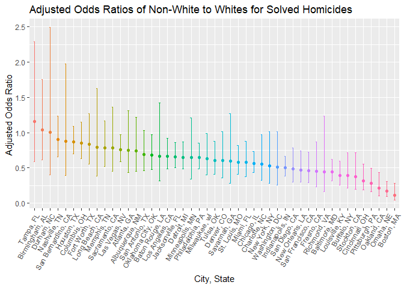

p8105\_hw6\_lz2657
================
Lingyu Zhang
Nov 18, 2018

Problem 1
---------

First, read and tidy the raw data.

``` r
homicide_url = "https://raw.githubusercontent.com/washingtonpost/data-homicides/master/homicide-data.csv"

homicide_data = 
  read.csv(url(homicide_url), stringsAsFactors = FALSE) %>% 
  janitor::clean_names() %>% 
  as_tibble()

homicide_data
```

    ## # A tibble: 52,179 x 12
    ##    uid   reported_date victim_last victim_first victim_race victim_age
    ##    <chr>         <int> <chr>       <chr>        <chr>       <chr>     
    ##  1 Alb-~      20100504 GARCIA      JUAN         Hispanic    78        
    ##  2 Alb-~      20100216 MONTOYA     CAMERON      Hispanic    17        
    ##  3 Alb-~      20100601 SATTERFIELD VIVIANA      White       15        
    ##  4 Alb-~      20100101 MENDIOLA    CARLOS       Hispanic    32        
    ##  5 Alb-~      20100102 MULA        VIVIAN       White       72        
    ##  6 Alb-~      20100126 BOOK        GERALDINE    White       91        
    ##  7 Alb-~      20100127 MALDONADO   DAVID        Hispanic    52        
    ##  8 Alb-~      20100127 MALDONADO   CONNIE       Hispanic    52        
    ##  9 Alb-~      20100130 MARTIN-LEY~ GUSTAVO      White       56        
    ## 10 Alb-~      20100210 HERRERA     ISRAEL       Hispanic    43        
    ## # ... with 52,169 more rows, and 6 more variables: victim_sex <chr>,
    ## #   city <chr>, state <chr>, lat <dbl>, lon <chr>, disposition <chr>

Now create a city\_state variable and a binary variable indicating whether the homicide is solved, and then omit some cities. Also modifiy victim\_race to have categories white and non-white, with white as the reference category and make sure that victim\_age is numeric.

``` r
homicide_data = homicide_data %>%
  mutate(city_state = str_c(city, ", ", state)) %>%
  mutate(solved = as.numeric(disposition != "Closed without arrest" & disposition != "Open/No arrest")) %>%
  filter(city_state != "Dallas, TX" & city_state != "Phoenix, AZ" & city_state != "Kansas City, MO" & city_state != "Tulsa, AL" & city_state != "PA, 40.461945") %>%
  mutate(victim_race = ifelse(victim_race == "White", "white","non-white"),
         victim_race = fct_relevel(victim_race, "white"), 
         victim_age = as.numeric(victim_age))
```

For Baltimore, fit a logistic regression with resolved vs unresolved as the outcome and victim age, sex and race as predictors, and obtain the estimate and confidence interval of the adjusted odds ratio for solving homicides comparing non-white victims to white victims keeping all other variables fixed.

``` r
baltimore_log = homicide_data %>% 
  filter (city_state == "Baltimore, MD") %>% 
  glm(solved ~ victim_age + victim_sex + victim_race, data = ., family = binomial())

baltimore_log %>% 
  broom::tidy(conf.int = TRUE, exponentiate = TRUE) %>%
  select(term, "adj odds ratio" = estimate, "CI: lower bound" = conf.low, 
           "CI: upper bound" = conf.high) %>% 
  knitr::kable(digits = 3)
```

| term                  |  adj odds ratio|  CI: lower bound|  CI: upper bound|
|:----------------------|---------------:|----------------:|----------------:|
| (Intercept)           |           3.274|            2.076|            5.212|
| victim\_age           |           0.993|            0.987|            0.999|
| victim\_sexMale       |           0.412|            0.315|            0.537|
| victim\_racenon-white |           0.441|            0.312|            0.620|

Now run glm for each city, and extract the adjusted odds ratio and CI for solving homicides comparing non-white victims to white victims.

``` r
logistic_function = function(df) {
  glm_fit = glm(solved ~ victim_age + victim_sex + victim_race, 
      data = df, family = binomial())
  
  glm_fit %>% 
    broom::tidy() %>% 
    mutate(odds_ratio = exp(estimate),
           conf_low = exp(estimate - 1.96 * std.error), 
           conf_high = exp(estimate + 1.96 * std.error))
}

homocide_odds_cities = homicide_data %>% 
  group_by(city_state) %>%
  nest() %>%
  mutate(log_models = map(data, logistic_function)) %>%
  select(-data) %>% 
  unnest() %>% 
  filter(term == "victim_racenon-white") %>% 
  select(city_state, odds_ratio, conf_low, conf_high)

homocide_odds_cities
```

    ## # A tibble: 47 x 4
    ##    city_state      odds_ratio conf_low conf_high
    ##    <chr>                <dbl>    <dbl>     <dbl>
    ##  1 Albuquerque, NM      0.741   0.451      1.22 
    ##  2 Atlanta, GA          0.753   0.432      1.31 
    ##  3 Baltimore, MD        0.441   0.313      0.620
    ##  4 Baton Rouge, LA      0.668   0.313      1.43 
    ##  5 Birmingham, AL       1.04    0.615      1.76 
    ##  6 Boston, MA           0.115   0.0472     0.278
    ##  7 Buffalo, NY          0.390   0.213      0.715
    ##  8 Charlotte, NC        0.558   0.321      0.969
    ##  9 Chicago, IL          0.562   0.431      0.733
    ## 10 Cincinnati, OH       0.318   0.184      0.551
    ## # ... with 37 more rows

Create a plot that shows the estimated ORs and CIs for each city.

``` r
homocide_odds_cities %>% 
  mutate(city_state = fct_reorder(city_state, desc(odds_ratio))) %>%
  ggplot(aes(x = city_state, y = odds_ratio, color = city_state)) + 
    geom_point() +
    geom_errorbar(aes(ymin = conf_low, ymax = conf_high, width = 0.2)) +
    theme(axis.text.x = element_text(angle = 60, hjust = 1), legend.position = "none") + 
    labs(
        title = "Adjusted Odds Ratios of Non-White to Whites for Solved Homicides",
        x = "City, State",
        y = "Adjusted Odds Ratio "
      )
```


